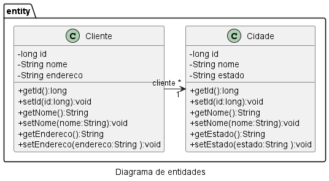

# Projeto Fábrica de Software FSO 2024 Turma A


## Classes de Entidade


# PROJETO projfso2024a
## Validação de campos
- Alterar o arquivo pom.xml para incluir a dependencia
```
    <dependency>
        <groupId>org.springframework.boot</groupId>
        <artifactId>spring-boot-starter-validation</artifactId>
    </dependency>
```

- Na classe de entidade incluir as anotações necessárias para fazer a validação
```
    @NotBlank(message = "Campo nome não pode ser em branco")
    private String nome;
```

## Anotações para mapeamento objeto relacional
O @Column permite configurar o tamanho e a possibilidade de obrigar o usuário a informar o campo
```
@Column(length = 1000, nullable = false)
private String nome;
```
O @Temporal é utilizado para tipar corretamente o campo de data no banco de dados
```
@Temporal(TemporalType.DATE)
private Date dataNascimento;
```

## Classe Startup
- Esta classe foi criada para ser executada na inicialização do software para criar registros padrão no banco de dados
```
@Component
public class Startup {
    @Autowired
    private ClienteService service;

    @EventListener
    public void onApplicationEvent(ContextRefreshedEvent event){
        var cliente1 = new Cliente();
        cliente1.setNome("Zezinho");
        cliente1.setEndereco("Rua lalalalla 100");
        cliente1.setDataNascimento(new Date(2024,04,17));
        service.save(cliente1);
    }
}
```
## Classe Repository
- Gera o código necessário para interação com o banco de dados no formato CRUD
```
@Repository
public interface ClienteRepository 
        extends JpaRepository<Cliente,Long>{
    
}
```
## Classe Service
- Utilizada para implementação da lógica de negócio da aplicação 
```
@Service
public class ClienteServiceImpl 
    implements ClienteService {
    
    @Autowired
    private ClienteRepository repository;
    
    @Override
    public void save(Cliente cliente) {
        repository.save(cliente);
    }

    @Override
    public Cliente getById(long id) {
        return repository.getById(id);
    }

    @Override
    public List<Cliente> getAll() {
        return repository.findAll();
    }
    
}
```
